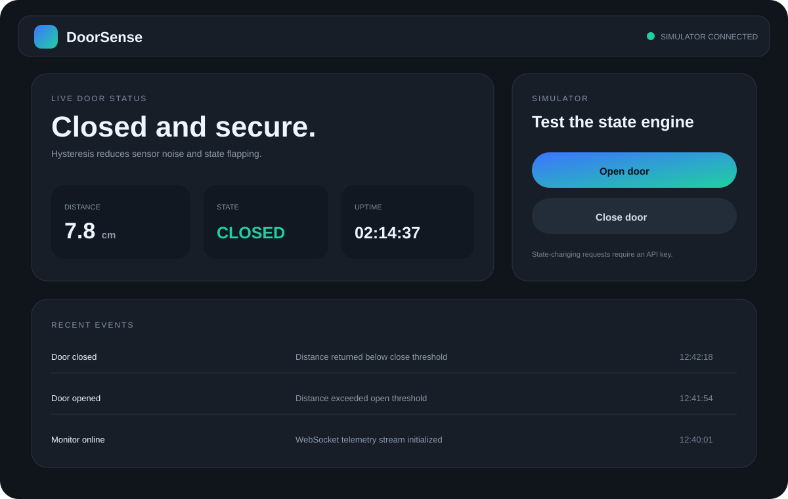
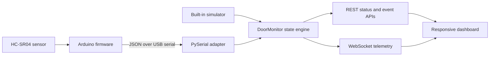

# DoorSense — Arduino Door Monitoring System

[](https://github.com/nityaroshinikandula4/arduino-door-monitoring-system/actions/workflows/ci.yml)


A complete IoT portfolio workflow: Arduino ultrasonic-sensor firmware, a threshold-based door-state engine, real-time WebSocket telemetry, event history, a hardware-independent simulator, and a responsive operations dashboard.



## Features

- HC-SR04 distance measurement and buzzer output in the Arduino sketch
- Compact JSON serial messages every 500 ms
- Closed, ajar, open, and unknown states with explicit thresholds
- State-change event creation and acknowledgement
- FastAPI REST endpoints and WebSocket broadcasting
- Default simulator so the dashboard works without physical hardware
- Optional PySerial adapter kept separate from the API core
- API-key protection for state-changing demo endpoints
- Unit and API tests with GitHub Actions CI

## Architecture



## Hardware

- Arduino Uno or compatible board
- HC-SR04 ultrasonic sensor
- Optional active buzzer
- Jumper wires and breadboard

Default pins:

| Component | Arduino pin |
|---|---:|
| HC-SR04 trigger | 9 |
| HC-SR04 echo | 10 |
| Buzzer | 6 |

## Run the dashboard

```bash
python -m venv .venv
source .venv/bin/activate            # Windows: .venv\Scripts\activate
pip install -r requirements.txt
uvicorn app.main:app --reload
```

Open `http://127.0.0.1:8000`. The simulator begins automatically.

## Upload the firmware

1. Open `firmware/door_monitor.ino` in the Arduino IDE.
2. Confirm the pins and thresholds match the wiring and doorway geometry.
3. Select the board and port, then upload.
4. Open Serial Monitor at `115200` baud to inspect the JSON stream.

`app/serial_bridge.py` shows how to parse the USB stream. A production deployment should run the adapter as a supervised process, reconnect after device loss, authenticate telemetry, and store events durably.

## Manual API test

```bash
curl -X POST http://127.0.0.1:8000/api/simulate \
  -H 'Content-Type: application/json' \
  -H 'X-API-Key: doorsense-local-demo' \
  -d '{"distance_cm": 42}'
```

Set `DOORSENSE_API_KEY` to replace the local development key.

## Testing

```bash
pytest -q
```

## Production considerations

- Calibrate thresholds per installation and add sensor debouncing/filtering.
- Use a dedicated device identity and encrypted telemetry rather than a shared API key.
- Add durable event storage, alert delivery, offline buffering, health monitoring, and firmware update controls.
- Treat this as a monitoring aid—not as a certified life-safety or access-control system.

## Author

**Nitya Roshini Kandula** — Java Full Stack Developer with experience across REST services, data workflows, testing, debugging, documentation, and applied IoT coursework.

[LinkedIn](https://www.linkedin.com/in/nitya-roshini-kandula-a44335283/) · [GitHub](https://github.com/nityaroshinikandula4)
